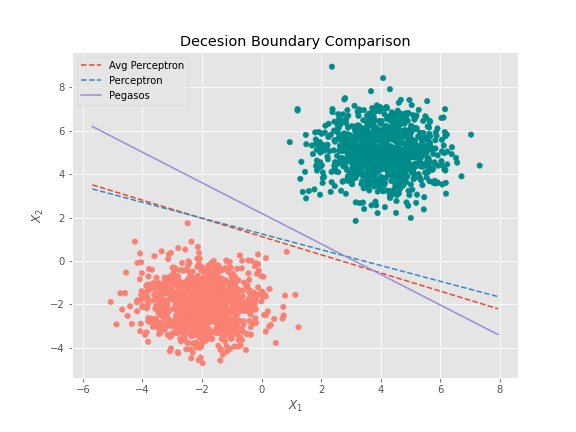
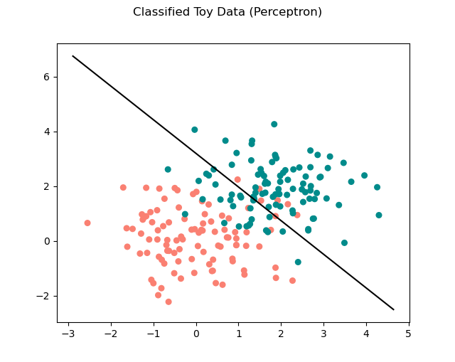

### Hyperparameters Tuning & Learning Algorithms
#### 1. Perceptron Algorithm
`Best T = 25`

#### 2. Average Perceptron Algorithm
`Best T = 25`

#### 3. Pegasos Algorithm
`Best T = 25`

`Best l = 0.01`

### Decesion Boundary Comparison
For each algorithm, I calculated parameters $\theta, \theta_0$ using linearly separable synthetic training data and plotted a corresponding decision boundary. **Pegasos** algorithm got the *best decesion boundary* of all three as expected. 

### Use classifiers on the food review dataset, using some simple text features.
>#### In order to automatically analyze reviews we will implement & compare the performance of the algorithms :

#### 1. Perceptron Algorithm
*Training Accuracy = 0.8157 , Validation Accuracy = 0.7160 , Best T = 25*

#### 2. Average Perceptron Algorithm
*Training Accuracy = 0.9728 , Validation Accuracy = 0.7980 , Best T = 25*

#### 3. Pegasos Algorithm
*Training Accuracy = 0.9143 , Validation Accuracy = 0.7900 , Best T = 25, Best l = 0.01*

#### Most Explanatory Words for positively labeled reviews:
1. Delecious
2. Great
3. !
4. Best
5. Perfect
6. Loves
7. Wonderful
8. Glad
9. Love
10. Quickly

### Predictions
>making predictions usig **Pegasos** `T = 25 & L = 0.01`
#### 1. Normal features pegasos
Training Accuracy = 0.9185
Test Accuracy = 0.8020
#### 1. Stopword features pegasos
Training Accuracy = 0.9157
Test Accuracy = 0.8080
#### 1. Stopword w/o binarize features pegasos
Training Accuracy = 0.8928
Test Accuracy = 0.7700

### Results
